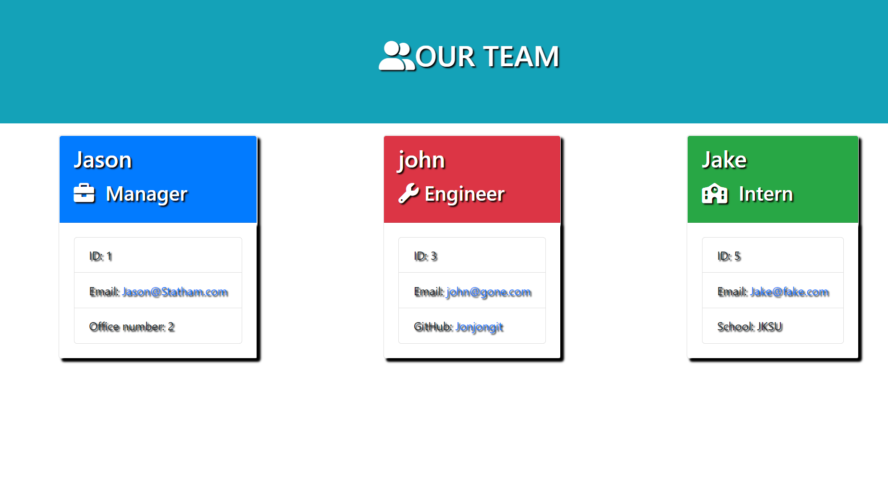
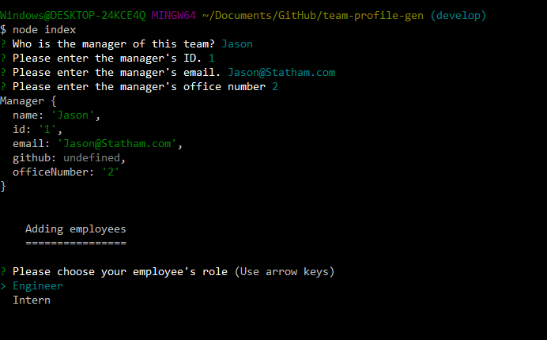

# Team Profile Generator
---
 

 

---
 
 

## User Story

AS A manager
I WANT to generate a webpage that displays my team's basic info
SO THAT I have quick access to their emails and GitHub profiles

 

---
 
 

## Acceptance Criteria

GIVEN a command-line application that accepts user input
WHEN I am prompted for my team members and their information
THEN an HTML file is generated that displays a nicely formatted team roster based on user input
WHEN I click on an email address in the HTML
THEN my default email program opens and populates the TO field of the email with the address
WHEN I click on the GitHub username
THEN that GitHub profile opens in a new tab
WHEN I start the application
THEN I am prompted to enter the team manager’s name, employee ID, email address, and office number
WHEN I enter the team manager’s name, employee ID, email address, and office number
THEN I am presented with a menu with the option to add an engineer or an intern or to finish building my team
WHEN I select the engineer option
THEN I am prompted to enter the engineer’s name, ID, email, and GitHub username, and I am taken back to the menu
WHEN I select the intern option
THEN I am prompted to enter the intern’s name, ID, email, and school, and I am taken back to the menu
WHEN I decide to finish building my team
THEN I exit the application, and the HTML is generated

 

---
 
 

## Description:
A team profile generator created for management employees to create and delete and employee profiles.
The application uses node.js and inquirer. Tests can be run with jest. Once the user initiates the app, the
user will be displayedprompts, once all prompts are complete, the file system is used to write a HTML file
that consists of the inputted information. The generate HTML file will be in the "/dist" folder labeled "index.html" 

 

---
 
 

## Usage and Installation

- Please download respository and run bash from the root of repository. 
- Type "npm install inquirer" in bash while still in root of repository.
- Type "node index" into bash terminal
- Use arrow keys to navigate and enter to select preferences
- Your html file will be in the "/dist" folder labeled "index.html"

### Testing
- Please download respository and run bash from the root of repository. 
- Type "npm install jest" in bash while still in root of repository.
- Type "npm test"

 

---
 
 

## Built With:

- Node.js
- Inquirer
- Jest
- javaScript
- Markdown

 

---
 
 

## Screenshots

 

 

 

---
 
 

## Demonstration

- [Demo](https://youtu.be/FJDMogc28NQ)

 

---
 
 

## Links

Deployed Application:

 - https://vithursan6.github.io/team-profile-gen

Github Repository:

 - https://github.com/vithursan6/team-profile-gen
 

---
 
 

## License

MIT License

Copyright (c) 2022 Vithursan6

Permission is hereby granted, free of charge, to any person obtaining a copy
of this software and associated documentation files (the "Software"), to deal
in the Software without restriction, including without limitation the rights
to use, copy, modify, merge, publish, distribute, sublicense, and/or sell
copies of the Software, and to permit persons to whom the Software is
furnished to do so, subject to the following conditions:

The above copyright notice and this permission notice shall be included in all
copies or substantial portions of the Software.

THE SOFTWARE IS PROVIDED "AS IS", WITHOUT WARRANTY OF ANY KIND, EXPRESS OR
IMPLIED, INCLUDING BUT NOT LIMITED TO THE WARRANTIES OF MERCHANTABILITY,
FITNESS FOR A PARTICULAR PURPOSE AND NONINFRINGEMENT. IN NO EVENT SHALL THE
AUTHORS OR COPYRIGHT HOLDERS BE LIABLE FOR ANY CLAIM, DAMAGES OR OTHER
LIABILITY, WHETHER IN AN ACTION OF CONTRACT, TORT OR OTHERWISE, ARISING FROM,
OUT OF OR IN CONNECTION WITH THE SOFTWARE OR THE USE OR OTHER DEALINGS IN THE
SOFTWARE.
 

---

